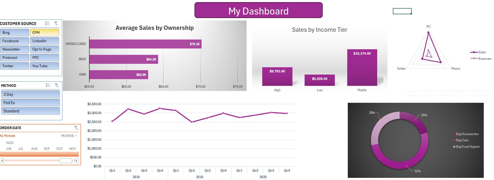

# Excel Data Project

# Table of contents

- [Objective](#objective)
- [Data Source](#data-source)

# Objective

- What is the key pain point?
  
The Data Analyst must structure and analyze sales and customer data for Dog Superstore using Excel to improve customer segmentation, revenue forecasting, and product performance evaluation. The primary goal is to identify key customer demographics, purchasing behaviors, and sales trends. Data from multiple sources, including customer profiles, purchase history, income levels, and product categories, must be organized for accurate reporting. The analyst will develop an Excel-based system, including pivot tables and dashboards, to visualize sales distribution, top-selling products, and device usage for online orders. Additionally, the team wants to assess quarterly sales performance and determine whether specific customer groups drive higher revenue.

- What is the ideal solution?

The ideal solution is to develop a well-structured Excel-based system that organizes and analyzes sales and customer data effectively. This system should include pivot tables, dashboards, and visual reports to identify key customer demographics, sales trends, and product performance. By integrating data from multiple sources—such as customer profiles, purchase history, income levels, and device usage—the solution will provide actionable insights that help optimize marketing strategies, improve inventory management, and enhance overall business performance.

## User story

"As a Data Analyst, I want an Excel-based dashboard that integrates sales and customer data, allowing me to quickly identify key customer demographics, purchasing behaviors, and sales trends. I want to analyze product performance, track device usage for online orders, and assess quarterly sales to optimize marketing strategies, improve inventory management, and enhance business decision-making.

# Data source

- What data is needed to achieve our objective?

  We need data on the company, including their
  - Data
  - Order ID
  - Product Category
  - Product Sub-Category
  - Region
  - State
  - Customer source
  - Order Date
  - Ship Date
  - Shipping Method
  - Expense
  - QTY Sold
  - Unit Price
  - Sales Amount
  - Profit
  - Customer ID
  - First Name
  - Last Name
  - Address
  - City
  - Homeownership
  - Urban/Rural
  - Income
  - Tier
  - Device Used
